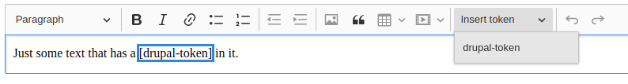

# ckeditor5-drupal-token
Drupal token plugin for CKEditor5 that allows brings tokens to ckeditor

## Usage

This project is for creating minified js for [Drupal CKEditor5](http://drupal.org/project/ckeditor5)

## Build
@TODO - build instructions?  Can these be linked in from somewhere authoritative?